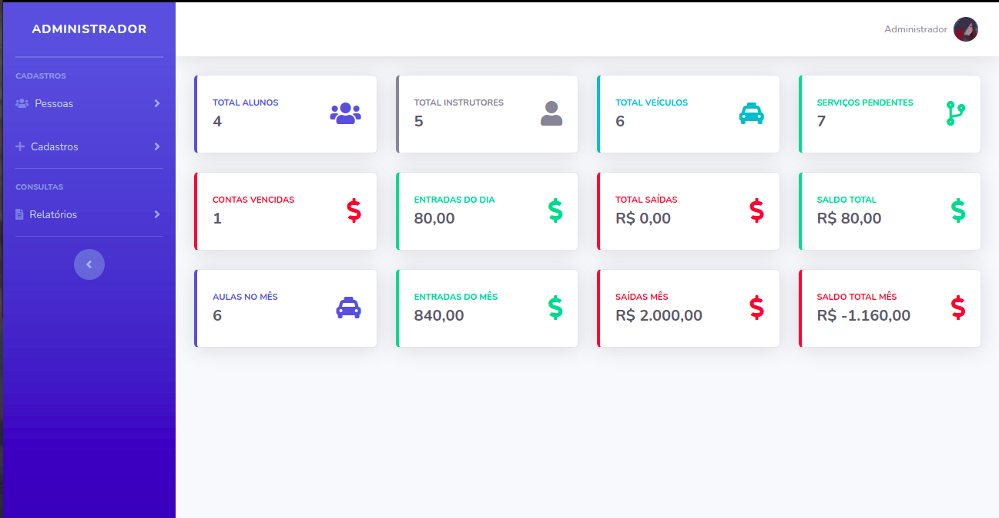
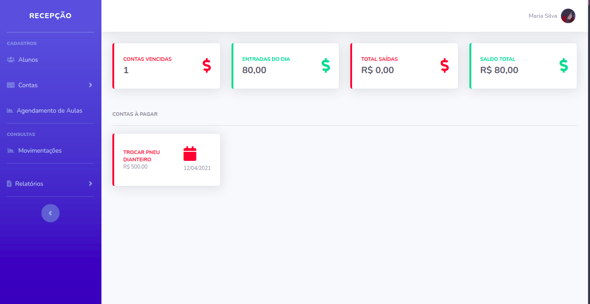
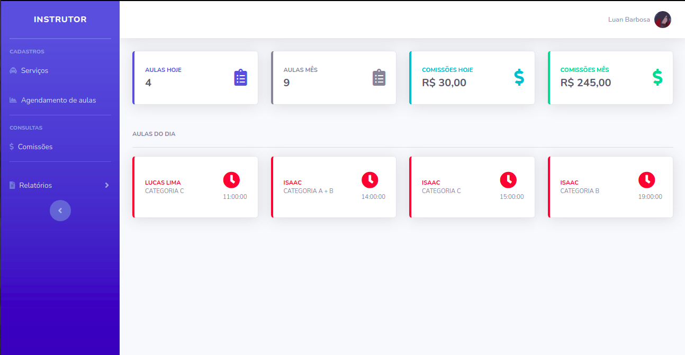

## Sistema de Auto Escola

      

  

> O projeto está separado em três classes principais, Administrador,Instrutor e Recepcionista

  

**Painel Adminstrativo**

O Painel Adminstrativo é responsável por:

  

- Cadastro de recepcionistas

- Cadastro de instrutores

- Cadastro de Categorias(A,B,C,D etc)

- Veículos

- Cadastro de valor de comissão por categoria e hora aula

- Associa veiculos a instrutores

- Horários que a autoescola marcam horários para aulas

- além de ter acesso a relatórios de todos os serviços e movimentações financeiras de instrutores e recepcionistas.

- Dashboard com resumo diário e mensal de todas as operações no sistema.

**Painel Recepcionista**

O painel da recepcionsta é responsável por:

- Cadastro de Alunos e atualização dos processos dos mesmos dentro da autoescola.

- Visualização e criação de contas a pagar e contas a receber e também dar baixa em serviços cobrados de alunos.

- Agendamento de aulas

- Relatório de movimentações, contas a pagar e contas a receber.

**Painel Instrutor**

O painel do instrutor é responsável por:

- Cadastra serviços realizados no veiculo tais como troca de óleo, revisão e etc.

- O instrutor também consegue visualizar e marcar aulas com alunos.

- O instrutor também pode visualizar o total de comissões recebidas por aula

- Dashboard Com as aulas do dia, comissões e aula-mês.